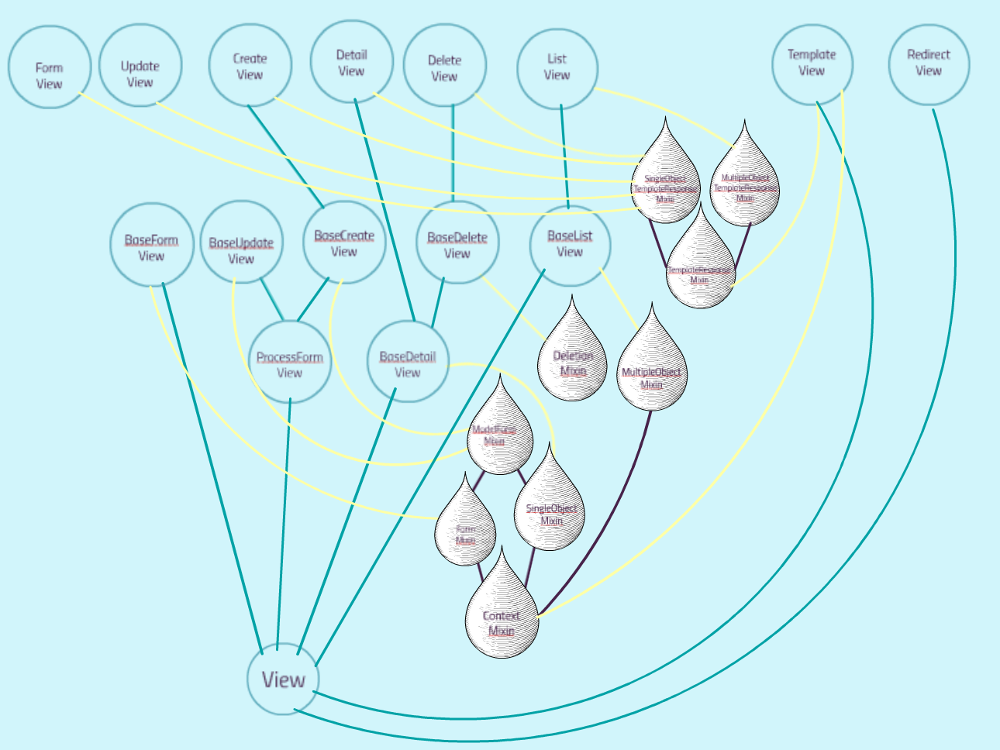

# Tutorial: Django’s class based generic views
- 10.06.2014 Presentation in the Django User Group Zurich

> This is a tutorial … not a blog post!

This blogpost hosts my tutorial on Django’s Class Based Generic Views, 
that aims to get newbies up to speed with that complicated, but nevertheless important topic in Django.

## What I think about CBGVs
I love them and I think that they are awesome. I have studied the Django-Rails debate in detail before I made my decision to use Django in my startup and CBGVs came up again and again in that discussion. They are the envy of Rails and they bring Django one step closer to Rails’ motto of “Convention over Customization”,  since they introduce conventions, but even better they still allow for customization. These conventions  are really helpful in order to get all the security stuff in your code for free. They also facilitate your understanding of your predecessors code, in case you take over from someone else, since it point you to where that code differs from the standard, rather then leaving you alone with an unstructured piece of code. Last not least it enhances the efficiency of your own programming. For all these reasons I feel everyone including newbies should take a good look at CBGVs: even if you reject them, it should be an informed decision.

## The Tutorial:
It shows you what is going on underneath the hood of CBGVs.
<iframe id="iframe_container" frameborder="0" webkitallowfullscreen="" mozallowfullscreen="" allowfullscreen="" width="550" height="400" src="https://prezi.com/embed/n5b1gge8-ev6/?bgcolor=ffffff&amp;lock_to_path=1&amp;autoplay=0&amp;autohide_ctrls=0&amp;landing_data=bHVZZmNaNDBIWnNjdEVENDRhZDFNZGNIUE43MHdLNWpsdFJLb2ZHanI5dVdtTlBRc0hpOTUxaVFOamRZY3UveDBBPT0&amp;landing_sign=UZS933BDuqhRbINZfmfJw1OpfVBjq2ELZkHNCsh8dZo"></iframe>

## Best screenshot
I included the one screenshots from the tutorial, that illustrates the inheritance structure of all Class Based Generic Views and their Mixins. The only thing excluded are all the date related Views and Mixins, since even though they probably have been very useful for the inventors of Django on their news site, most people including me don’t use them very much. I put that screenshot here, since I want you to be able to come back to it without the pain of scrolling through the tutorial yet another time.

## Sources that your urgently need when you get started with CBGVs:
### 1. Documentation | very urgent!
Classy Class-Based Views  is the perfect starting point for all documentation on CBGVs is: This awesome site shows you all the hierarchies, the methods you can overwrite, the attributes, the source code and it even takes you to the Django documentation.

### 2. Django-Braces | not urgent, but very helpful
The package django-braces contains a lot of very useful Mixins, such as the LoginRequiredMixin, that come in handy when working with CBGVs. Mixins do for CBGVs what decorators do for function based views and they may be even used to just that purpose: overwrite a method with a decorator.
